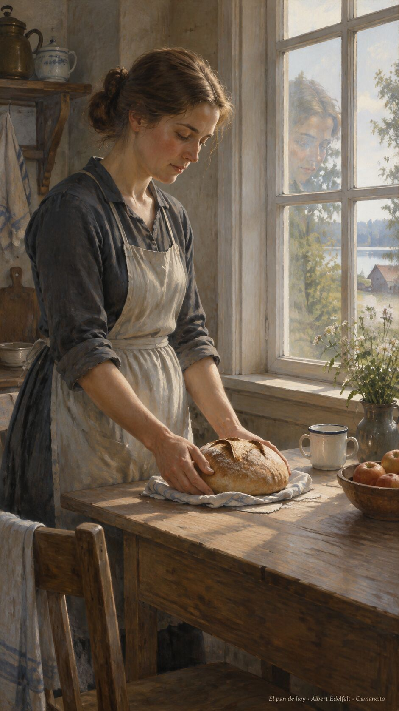
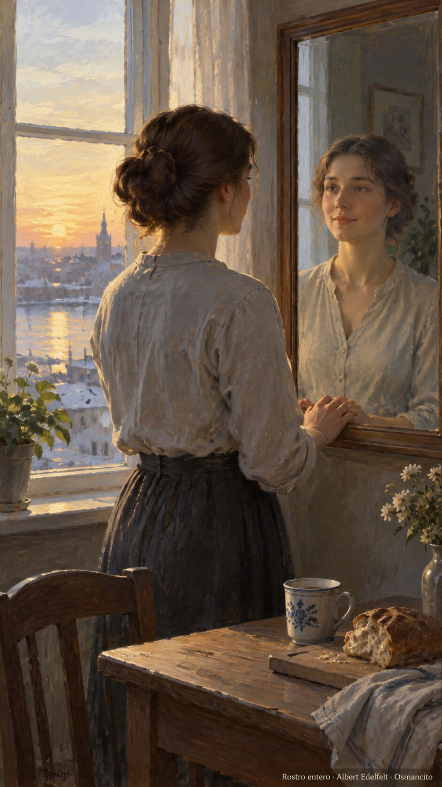
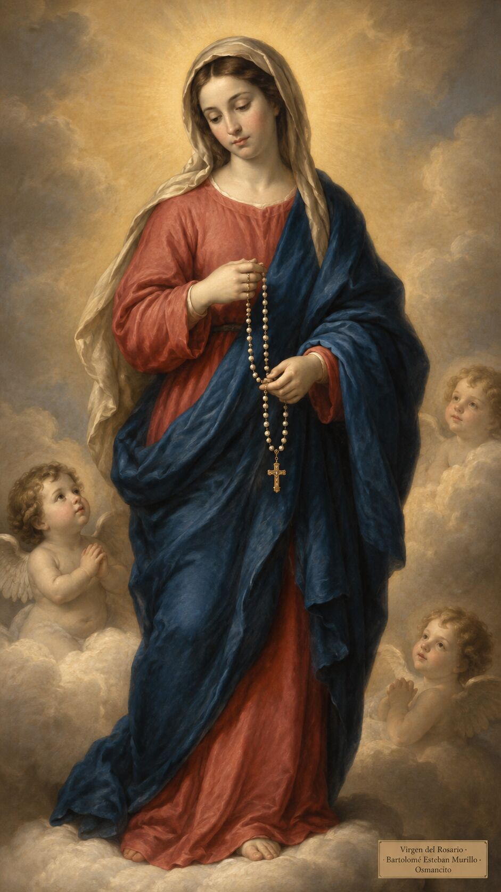
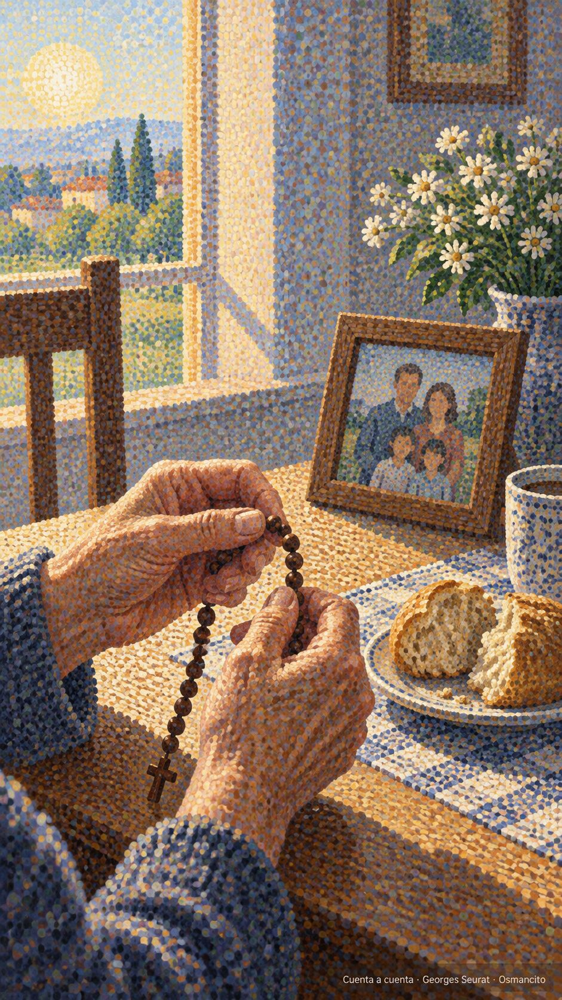
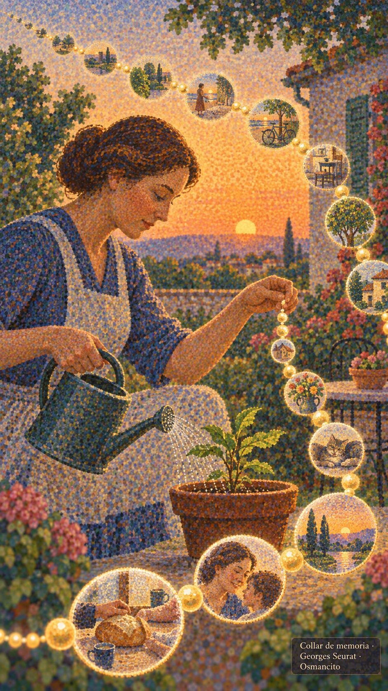

# 7 de octubre de 2026

_¡Buenos días!_

*_El pan de hoy y el rostro entero_*

_Hay una manera de vivir con el rostro dividido: decir una cosa y hacer otra, por miedo a desagradar._

_La verdad no pide tanto: solo que lo de adentro y lo de afuera coincidan. Pedir poco, dar gracias, empezar de nuevo cada día, como quien respira._

_Lo que rescata no es la fuerza propia sino la confianza simple, esa que se anima a pedir el pan de hoy y nada más._

*_¡Feliz miércoles 7 de octubre!_*

---

_En memoria de Nuestra Señora..._

*_La Virgen del Rosario_*

_A ella, que enseña a contar lo bueno con los dedos, le cantamos bajito, como quien reza sin darse cuenta. Madre de la paciencia, teje el tiempo en cuentas y guarda cada nombre en el bolsillo del manto. A su sombra caben todos los cansados._

_Que hoy la casa huela a pan, la mesa se llene, y nadie se vaya sin haber dicho, al menos una vez, gracias en voz alta._

*_¡Feliz día de la Virgen del Rosario!_*

---

*_Cuenta a cuenta_*

_Contar de a uno, con los dedos, lo que se agradece: una cuenta por cada pan, cada rostro, cada tarde que no dolió. Así la memoria se vuelve collar y el tiempo, cuenta a cuenta, se ensarta. No hacen falta palabras grandes: basta repetir con cariño lo pequeño, como quien riega. La repetición, bien querida, no es costumbre vacía: es la escalera corta que baja el alma hasta lo cotidiano y lo encuentra bueno._

