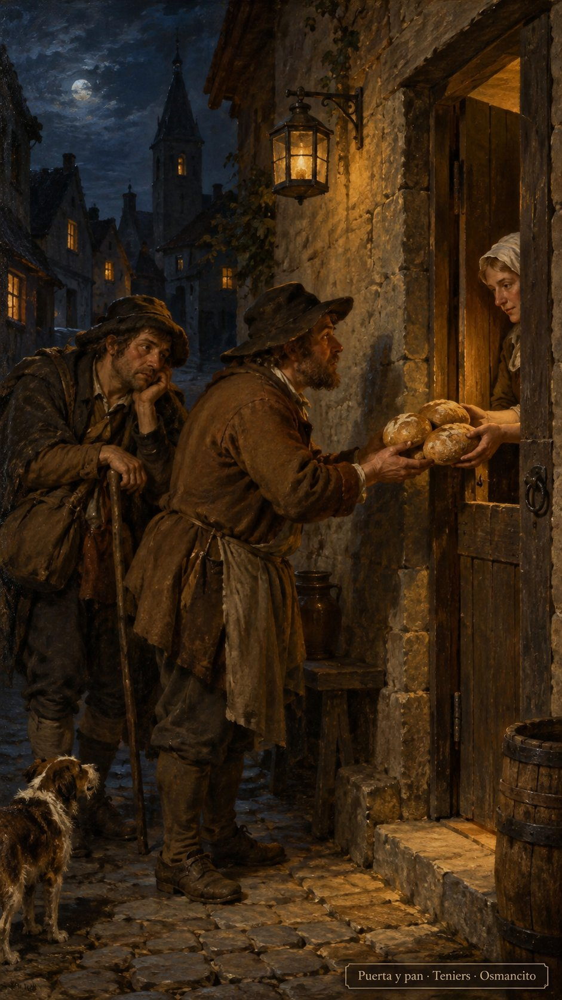
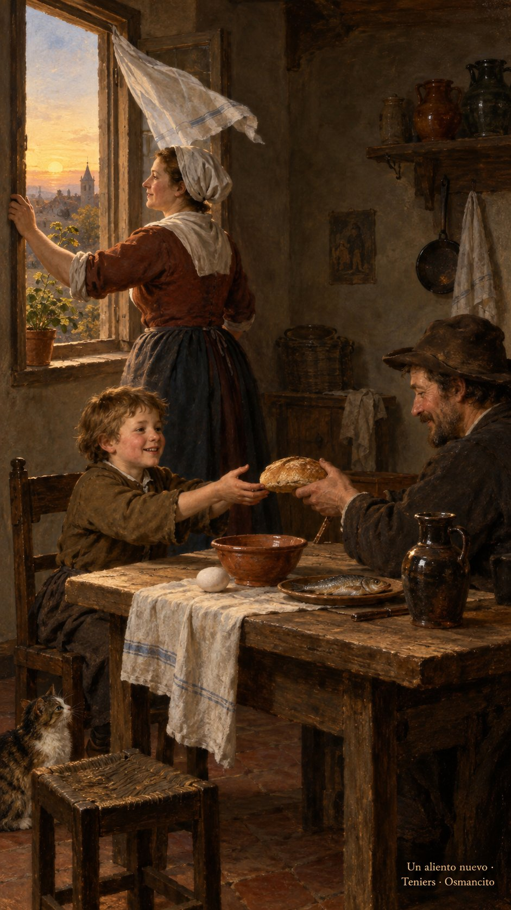

# 8 de octubre de 2026

_¡Buenos días!_

**_Un aliento nuevo_**

_Que volvamos a la confianza que nos puso en camino, sin convertir cada regalo en una cuenta por pagar. Que pidamos pan para el viajero y abramos la puerta aunque sea medianoche. Que insistamos sin endurecernos, busquemos sin miedo y reconozcamos la mano que ofrece alimento, nunca piedras. Que la memoria del bien nos sostenga, y vivamos libres para cuidar. Que nuestras manos aprendan a recibir lo que ninguna fuerza consigue comprar: un aliento nuevo._

**_¡Feliz jueves 8 de octubre!_**

😊🙋‍♂
