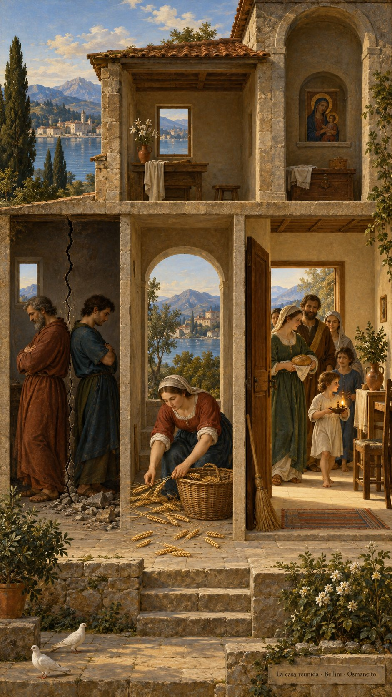
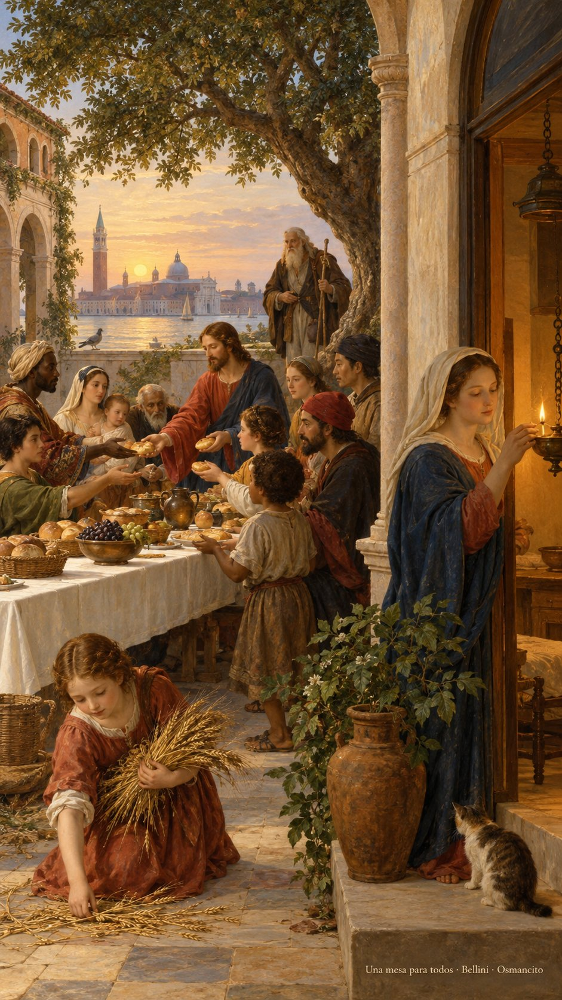
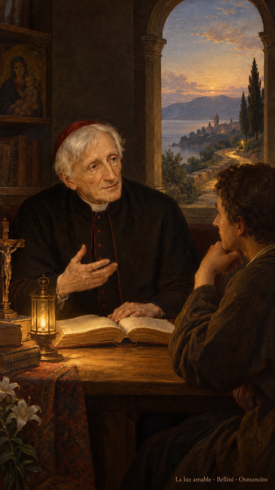
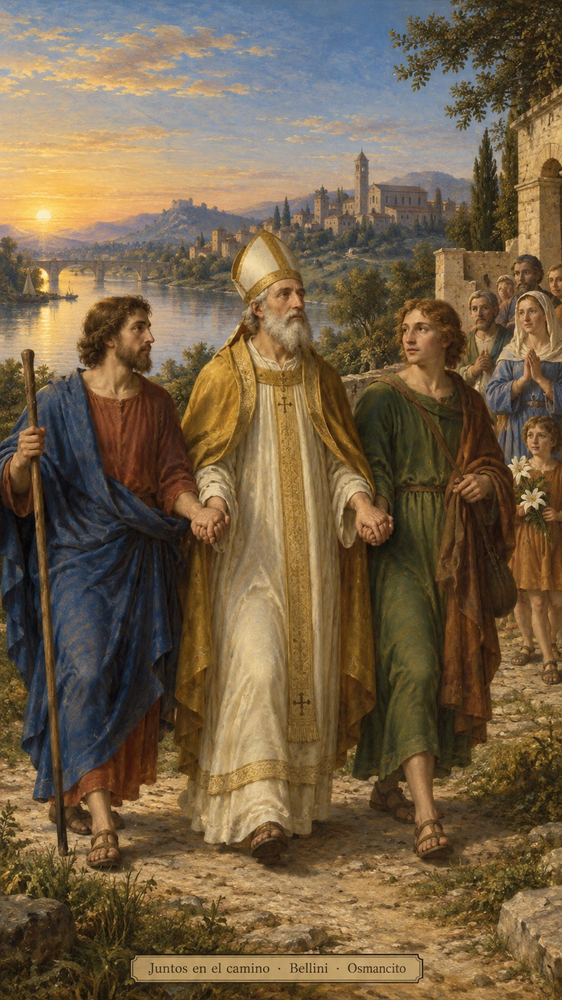
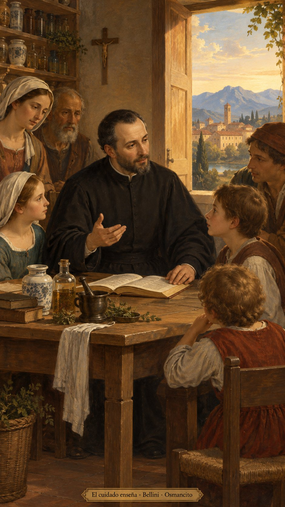

9 de octubre de 2026

_¡Buenos días!_

# La casa reunida

_Que reunamos lo que el miedo dispersa y cuidemos la casa que compartimos. Que la confianza nos haga familia más allá del apellido, del país y de las cuentas pendientes. Que recordemos el pan recibido y extendamos la mesa hacia quienes llegan. Que barramos el rencor y llenemos su lugar de presencia, para que el vacío encuentre compañía. Que dejemos crecer una fuerza buena: la que libera, acerca y sostiene nuestras vidas desde la raíz._

- La pared agrietada y las figuras vueltas de espaldas recuerdan la casa dividida de Lucas 11. Las espigas reunidas encarnan su invitación a recoger juntos.
- La escoba, la puerta abierta y la familia que entra con pan y luz vuelven cuidado compartido la imagen de la casa barrida.

- La mesa que recibe a personas de distintas procedencias y el anciano viajero evocan la bendición de Abraham extendida a todos los pueblos en Gálatas 3. El pan compartido recoge la memoria del alimento y la alianza del Salmo 110.

**_¡Feliz viernes 9 de octubre!_**

😊🙋‍♂

---

_En memoria de san Juan Enrique Newman..._

## La luz amable

_Que aprendamos de su paciencia a caminar con la luz que alcanza para el próximo paso. Que escuchemos esa voz pequeña que pide verdad, aunque cambie nuestro rumbo. Que los libros abran ventanas y la conversación acerque los corazones. Que sepamos cambiar para ser fieles a lo que reconocemos bueno, y acompañemos a otros sin empujarlos. Que hoy una lámpara humilde nos baste para seguir buscando, con la mano abierta y el corazón despierto._

- La lámpara y el camino de Newman recuerdan su poema sobre la luz amable; el libro abierto y la conversación cercana, su búsqueda paciente y su lema de corazón a corazón.

**_¡Feliz memoria de san Juan Enrique Newman!_**

😊🙏

---

_En memoria de san Dionisio y sus compañeros..._

## Juntos en el camino

_Que honremos a quienes sostienen su palabra cuando el camino se vuelve difícil. Que la compañía de Dionisio, Rústico y Eleuterio nos recuerde cuánto abriga una mano junto a otra. Que llevemos al encuentro una esperanza que se deja ver en el cuidado, y permanezcamos cerca de quien teme. Que la fidelidad tenga rostro de amistad, paso paciente y mesa abierta. Que aprendamos a caminar juntos y hagamos del valor una forma de acompañar._

- Las manos enlazadas de Dionisio y sus compañeros evocan una fidelidad sostenida juntos.

**_¡Feliz memoria de san Dionisio y sus compañeros!_**

😊🙏

---

_En memoria de san Juan Leonardi..._

## El cuidado enseña

_Que aprendamos de Juan Leonardi a poner lo que sabemos al servicio de quien llega. Que nuestras manos, capaces de preparar remedios, sepan también abrir un libro y escuchar una pregunta. Que enseñar sea una manera de cuidar, y cuidar una manera de aprender. Que la paciencia se siente a la mesa con los pequeños y cada palabra encuentre un rostro. Que renovemos la casa desde dentro, con atención humilde, trabajo compartido y afecto._

- Los frascos de botica, el libro y los oyentes de Leonardi unen sus comienzos y su dedicación a enseñar.

**_¡Feliz memoria de san Juan Leonardi!_**

😊🙏
