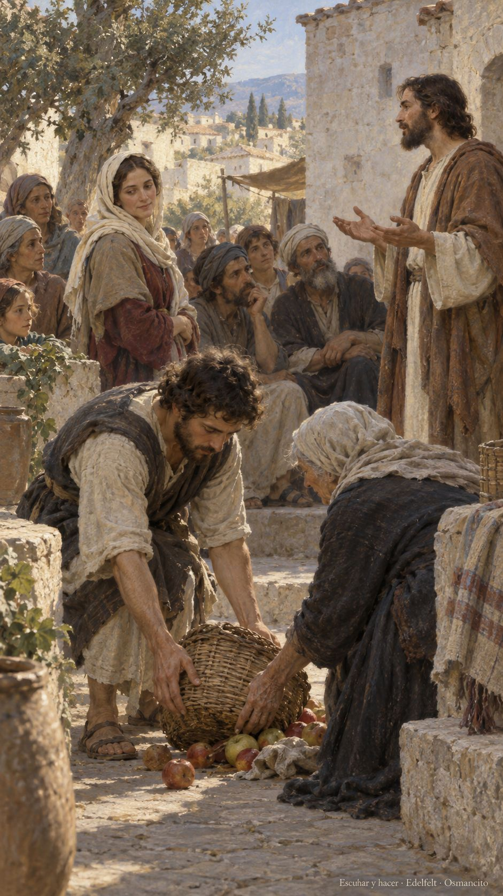
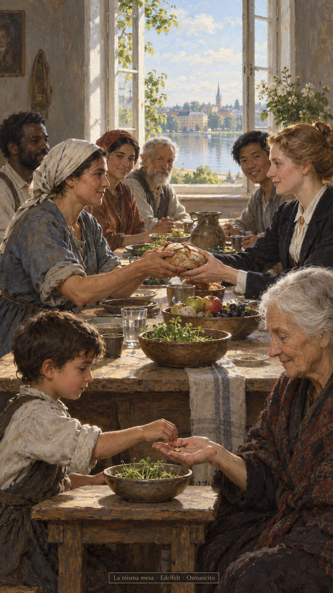

10 de octubre de 2026

_¡Buenos días!_

# Escuchar y hacer

_Que escuchemos con el corazón despierto y dejemos que lo oído se vuelva gesto. Que ninguna diferencia nos quite el sitio en la mesa, ni el nombre, ni la esperanza compartida. Que recordemos las promesas que nos sostuvieron cuando el camino parecía cerrado. Que busquemos juntos una fuerza buena, capaz de acercar nuestras vidas. Que la alegría no dependa del linaje, sino del cuidado que practicamos: recibir, acompañar y abrir espacio para quien llegue mañana._

- La mujer entre la multitud y el gesto de levantar la cesta acercan la escucha a la práctica de Lucas 11: la palabra encuentra cuerpo en el cuidado.

- La mesa sin lugar de honor recoge la igualdad de Gálatas 3. La semilla compartida y los brotes recuerdan las promesas y la memoria agradecida del Salmo 104.

**_¡Feliz sábado 10 de octubre!_**

😊🙋‍♂
